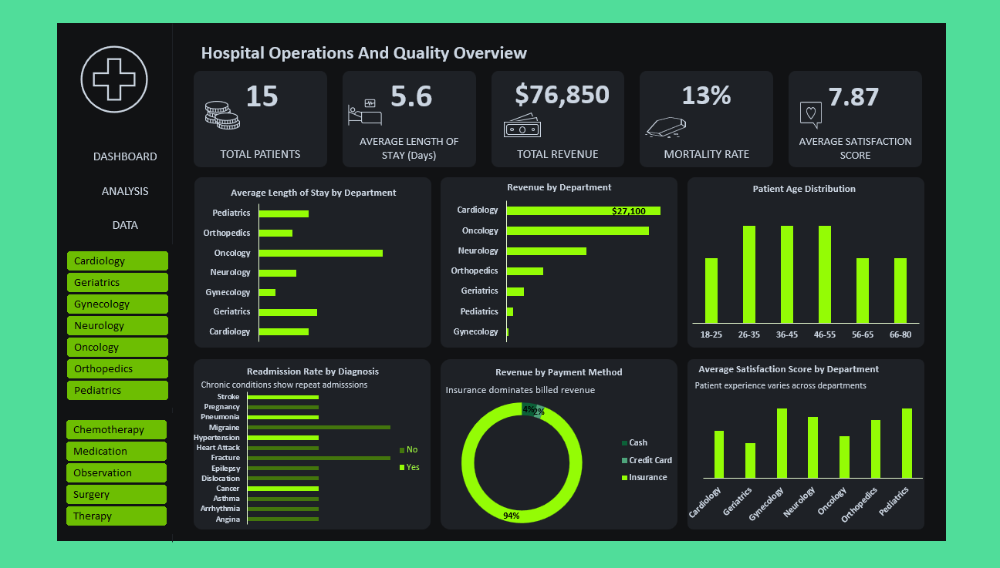
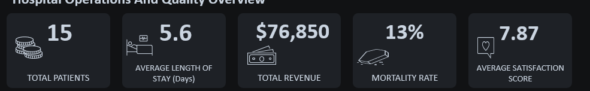
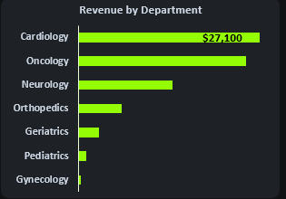
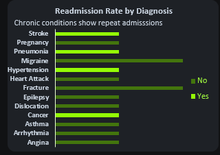
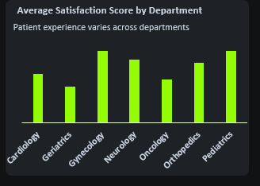

# Hospital Operations and Quality Overview

> How 15 patient records across seven departments revealed where cost, quality of care, and mortality risk were concentrated in a small hospital's operations.



---

## Project Type

- [x] Exploratory Analysis
- [x] Dashboard / Visualization
- [x] Data Cleaning
- [x] End-to-End Project

---

## Table of Contents

1. [Executive Summary](#1-executive-summary)
2. [Key Takeaways](#2-key-takeaways)
3. [Background & Problem](#3-background--problem)
4. [Stakeholders](#4-stakeholders)
5. [Objectives & Success Metrics](#5-objectives--success-metrics)
6. [Project Scope](#6-project-scope)
7. [Tools Used](#7-tools-used)
8. [Repository Structure](#8-repository-structure)
9. [Dataset Overview & Data Dictionary](#9-dataset-overview--data-dictionary)
10. [Data Cleaning & Quality](#10-data-cleaning--quality)
11. [Methodology & Exploratory Analysis](#11-methodology--exploratory-analysis)
12. [Analytical Decisions](#12-analytical-decisions)
13. [Validation](#13-validation)
14. [Key Findings](#14-key-findings)
15. [Dashboard / Report Walkthrough](#15-dashboard--report-walkthrough)
16. [Dashboard Design Decisions](#16-dashboard-design-decisions)
17. [Recommendations](#17-recommendations)
18. [Data Privacy & Ethical Considerations](#18-data-privacy--ethical-considerations)
19. [Clinical / Public Health Context](#19-clinical--public-health-context)
20. [Assumptions & Limitations](#20-assumptions--limitations)
21. [Conclusion](#21-conclusion)
22. [AI Usage Disclosure](#22-ai-usage-disclosure)
23. [How to Reproduce This Project](#23-how-to-reproduce-this-project)
24. [Author](#24-author)

---

## 1. Executive Summary

This project analyzed 15 patient encounter records spanning seven hospital departments to understand where
cost, patient satisfaction, and mortality risk were concentrated. Using Excel PivotTables and a native
dashboard, the analysis found that two departments, Cardiology and Oncology, accounted for 68% of total
revenue, and that every recorded death in the dataset occurred among patients who had a prior readmission.
Patient satisfaction also varied sharply by department, with Geriatrics scoring lowest at 5 out of 10 against
an overall average of 7.87. Small as the dataset is, the pattern is specific enough to point toward exactly
where a hospital's operations and quality teams should look first.

---

## 2. Key Takeaways

1. Cardiology and Oncology together drove 68% of total revenue, despite making up a third of recorded patients.
2. Both deaths in the dataset occurred among patients who had been readmitted, not first-time admissions.
3. Geriatrics had the lowest average satisfaction score of any department, well below Gynecology and Pediatrics.

---

## 3. Background & Problem

A small hospital wanted a first look at how its patient encounters were distributed across departments, before
committing to a larger, ongoing analytics build. Rather than waiting for a full year of records, this project
uses a sample of 15 encounters to prototype the questions worth asking and confirm the dashboard logic works,
answering: where are cost, quality, and mortality risk concentrated across departments, and which patterns are
strong enough to justify closer attention once more data comes in?

---

## 4. Stakeholders

| Stakeholder | Why This Work Matters to Them |
|---|---|
| Hospital Operations Manager | Uses department-level cost and volume findings to plan resource allocation |
| Clinical Quality Lead | Uses the readmission and mortality pattern to prioritize follow-up care review |
| Finance Team | Uses the payment method and insurance billing gap to inform billing policy |

---

## 5. Objectives & Success Metrics

- **Objective:** Identify which departments and patient groups are driving cost, low satisfaction, and mortality
  risk, and validate that the dashboard correctly surfaces these patterns before scaling to a full dataset.
- **Target:** Confirm at least one actionable, department-level pattern strong enough to justify a focused
  follow-up review once a larger dataset is available.

---

## 6. Project Scope

| In Scope | Out of Scope |
|---|---|
| 15 patient encounters across 7 departments, single snapshot period | Time-series trends across multiple years, since the sample covers a single batch of records rather than a continuous reporting period |
| Department, diagnosis, payment, and satisfaction-level breakdowns | Individual clinician or shift-level performance, not captured in this dataset |

---

## 7. Tools Used

| Stage | Tool |
|---|---|
| Data source | Synthetic hospital patient-level dataset (Excel workbook) |
| Data cleaning | Excel |
| Analysis | Excel PivotTables |
| Visualization | Excel (native dashboard) |

---

## 8. Repository Structure

```
hospital-operations-overview/
│
├── data/
│   └── Hospital_Overview_Dataset__version_1___Okikiola_Oyeniyi.xlsx
│
├── visuals/
│   ├── dashboard_full.png
│   ├── kpi_snapshot.png
│   ├── revenue_by_department.png
│   ├── readmission_by_diagnosis.png
│   └── satisfaction_by_department.png
│
└── README.md
```

---

## 9. Dataset Overview & Data Dictionary

The dataset holds 15 patient encounter records across seven departments, each with a single row per patient
covering admission, treatment, billing, and outcome. It is a synthetic sample built to prototype hospital
operations reporting, not a live or continuously collected dataset.

| Field | Type | Description | Example |
|---|---|---|---|
| `Patient ID` | string | Unique patient encounter identifier | `P0004` |
| `Department` | string | Department the patient was treated in | `Cardiology` |
| `Diagnosis` | string | Primary diagnosis for the encounter | `Arrhythmia` |
| `Length of Stay` | integer | Days between admission and discharge | `4` |
| `Total Bill Amount` | currency | Total billed for the encounter | `8000` |
| `Payment Method` | string | How the bill was paid | `Insurance` |
| `Satisfaction Score` | integer (1–10) | Patient-reported satisfaction | `6` |
| `Readmission` | boolean | Whether this was a repeat admission | `No` |
| `Mortality Status` | string | Outcome of the encounter | `Survived` |

**Source:** Synthetic hospital dataset, `Hospital_Overview_Dataset__version_1___Okikiola_Oyeniyi.xlsx`
**Access notes:** Fully synthetic. No real patient data is represented anywhere in this dataset.

---

## 10. Data Cleaning & Quality

**Question:** Was the dataset ready to analyze?

**What I found:** The workbook's own summary pivot labeled Cardiology as the top department by patient volume,
but recalculating directly from the 15 source rows showed Cardiology and Neurology tied at 4 patients each,
not a clear single leader.
**What I changed:** Reported the tie explicitly in this documentation rather than repeating the workbook's
single-department label at face value.
**Why it mattered:** With only 15 records, a one-patient difference changes a headline claim. Restating it
correctly keeps the "top department" finding honest rather than overstated.

---

## 11. Methodology & Exploratory Analysis

**Question:** How did I approach finding the answer?

Used department-level and diagnosis-level PivotTables to compare volume, revenue, length of stay, and
satisfaction side by side, rather than a statistical model, since the sample size (15 records) is far too
small to support anything beyond direct description. Early exploration showed that most departments had only
one or two patients each, which meant every per-department figure needed to be read as a small-sample snapshot,
not a stable average, and shaped how the findings below are worded.

---

## 12. Analytical Decisions

Reported revenue concentration by department in dollar terms rather than only as a percentage, because a
percentage alone (68%) understates how much of that figure comes from just two single patients in Oncology and
a handful in Cardiology. Trade-off: pairing the dollar figures with the percentage makes the summary slightly
longer, but it stops the finding from reading as more statistically stable than it actually is.

---

## 13. Validation

**Question:** Could these numbers be trusted?

Recalculated total revenue, average length of stay, and mortality rate directly from the 15-row source data and
compared them against the workbook's own PivotTable summary → cross-checked every KPI card figure line by line →
all five headline KPIs (15 patients, 5.6-day average stay, $76,850 total revenue, 13% mortality rate, 7.87
average satisfaction) matched exactly, with the one exception noted in Data Cleaning & Quality above regarding
the top-department tie.

---

## 14. Key Findings



| KPI | Result | What It Tells Us |
|---|---:|---|
| Total Patients | 15 | A small prototype sample, not yet large enough for statistical confidence |
| Average Length of Stay | 5.6 days | Baseline stay duration, though it hides a wide spread by department |
| Total Revenue | $76,850 | Concentrated in a small number of departments rather than spread evenly |
| Mortality Rate | 13% (2 of 15) | Both cases share a specific pattern worth investigating further |
| Average Satisfaction Score | 7.87 / 10 | A reasonable overall score that masks a real gap between departments |

**What do these numbers tell us?** No single KPI on its own looks alarming, but together they point to
concentration rather than an even spread: a small number of departments carry most of the revenue, and the
outcomes that matter most, mortality and satisfaction, aren't evenly distributed either.

**What should we look at next?** The dashboard below breaks down exactly where that concentration sits, and
what connects the two mortality cases in this dataset.

---

## 15. Dashboard / Report Walkthrough

### Page 1: Hospital Operations and Quality Overview

**What does this page help us understand?** Where cost, patient volume, and quality of care are concentrated
across the hospital's seven departments.


The KPI cards across the top set the baseline first, total patients, average stay, total revenue, mortality
rate, and satisfaction, before the six supporting charts break each of those numbers down by department,
diagnosis, age, and payment method.

#### Revenue by Department



**Question this visual answers:** Which departments are generating the hospital's revenue?
**What the data shows:** Cardiology ($27,100) and Oncology ($25,000) together account for $52,100 of the
$76,850 total, 68% of all revenue, while Gynecology and Pediatrics each bring in $1,100 or less.
**What it means:** Revenue isn't spread evenly across departments, it's concentrated in two, and Oncology's
share comes from just a single patient's chemotherapy treatment.
**Why it matters:** A hospital reading this dashboard would know exactly where its highest-cost care is
happening, and that Oncology's number is one patient away from looking very different once more data comes in.

#### Readmission Rate by Diagnosis



**Question this visual answers:** Which diagnoses are associated with a patient being readmitted?
**What the data shows:** All four readmitted patients in the dataset carried chronic or acute-recurring
diagnoses, stroke, hypertension, pneumonia, and cancer, while every one-off diagnosis, such as fractures or
asthma, showed no readmission.
**What it means:** Readmission in this dataset tracks tightly with diagnosis type rather than appearing
randomly across the patient population.
**Why it matters:** Both patients who died in this dataset also appear on this readmission list, which is the
strongest signal in the entire project and is broken down further in the recommendations below.

#### Average Satisfaction Score by Department



**Question this visual answers:** Does patient experience differ by department?
**What the data shows:** Geriatrics recorded the lowest average satisfaction score at 5 out of 10, while
Gynecology and Pediatrics both averaged a perfect 10.
**What it means:** The overall average of 7.87 hides a real gap, Geriatrics patients are reporting a
meaningfully worse experience than patients anywhere else in the hospital.
**Why it matters:** Satisfaction scores this far below the hospital average are worth a direct look, especially
alongside the fact that one of the two deaths in this dataset was a Geriatrics patient.

---

## 16. Dashboard Design Decisions

**KPI cards placed at the top:** Anyone opening this dashboard, from a department head to a finance reviewer,
should be able to read the five most important numbers in under ten seconds before deciding which chart to
look at next.
**Department used as the common axis across most charts:** Since the driving question behind this project is
"where is this concentrated," keeping department as the shared lens across revenue, stay length, and
satisfaction lets a reader compare the same department across multiple angles without re-orienting each time.

---

## 17. Recommendations

**Finding:** Both deaths in this dataset occurred among patients with a documented prior readmission.
**Recommendation:** Flag readmitted patients for a closer follow-up care review, rather than treating
readmission and mortality as separate tracking metrics.
**Why:** With only two mortality cases in the dataset, this can't be treated as statistical proof, but the
pattern is specific enough that it shouldn't be dismissed either, it's exactly the kind of signal a larger
dataset should be checked against first.
**Suggested owner:** Clinical Quality Lead

**Finding:** Geriatrics scored lowest on patient satisfaction (5/10) despite being a small, one-patient sample.
**Recommendation:** Prioritize Geriatrics for direct patient feedback collection once more encounters are
recorded, to confirm whether the low score holds at scale.
**Why:** A single low score in a one-patient department could be noise or could be an early warning, the only
way to tell is more data from the same department.
**Suggested owner:** Hospital Operations Manager

---

## 18. Data Privacy & Ethical Considerations

- **De-identification:** Not applicable in the traditional sense, the dataset is fully synthetic and was built
  for demonstration purposes. No real patient data is represented anywhere in this project.
- **Regulation:** None applicable, as no real patient data is involved. If this dashboard is extended to real
  hospital records, it would fall under the Nigeria Data Protection Act, 2023, and would need a full
  de-identification review before publication.
- **Use notes:** Findings in this version are meant to demonstrate the analytical approach and dashboard logic,
  not to represent the actual performance of any real hospital or department.

---

## 19. Clinical / Public Health Context

A 13% mortality rate and a 27% readmission rate would both be high by real-world hospital benchmarks if this
were a live dataset of any meaningful size. With only 15 records, these figures should be read as a
proof-of-concept for how the dashboard would flag such a pattern, not as a claim about actual clinical
performance. The value of this project is in showing that the dashboard correctly surfaces a mortality and
readmission overlap when it exists, which is the kind of signal a real deployment would need to catch early.

---

## 20. Assumptions & Limitations

**Assumptions**
- Treated each row as one complete, independent patient encounter, since the dataset provides no linkage
  between multiple visits by the same patient beyond the readmission flag itself.
- Treated the "Readmission" field as reliably indicating a genuine prior admission for the same or a related
  condition, since no separate visit history was provided to confirm it.

**Limitations**
- With 15 total records and most departments represented by only one to four patients, none of the
  department-level figures in this project should be read as statistically stable. A single patient can shift
  a department's entire average.
- The mortality-readmission overlap is based on two cases. It's a real pattern in this dataset and worth
  flagging, but it is not large enough to generalize from.

---

## 21. Conclusion

What started as a small prototype dataset turned out to hold a genuinely useful signal: every recorded death
in this data followed a prior readmission, and revenue, cost, and satisfaction all cluster around the same
handful of departments rather than spreading evenly across the hospital. None of this is large enough to act on
by itself, but it's exactly the kind of pattern a larger, ongoing dataset should be checked against first, and
it confirms the dashboard is built to catch it when it matters.

---

## 22. AI Usage Disclosure

- **AI-assisted:** Verification of KPI figures against source data
- **Not AI-assisted:** Dataset creation, dashboard design and build, final interpretation and recommendations

---

## 23. How to Reproduce This Project

1. Open `data/Hospital_Overview_Dataset__version_1___Okikiola_Oyeniyi.xlsx` in Excel.
2. Review the `source Data` sheet for the raw 15-record dataset and the `ANALYSIS` sheet for the underlying
   PivotTables.
3. Open the `Hospital Dashboard` / `DASHBOARD` sheet to view or rebuild the visual layout shown in this README.

---

## 24. Author

**Oyeniyi Okikiola (Kiki)** — Healthcare Data Analyst
- LinkedIn: linkedin.com/in/kikiblacc
- Portfolio: oyeniyiokikiola.github.io

*Last updated: August 2026*
